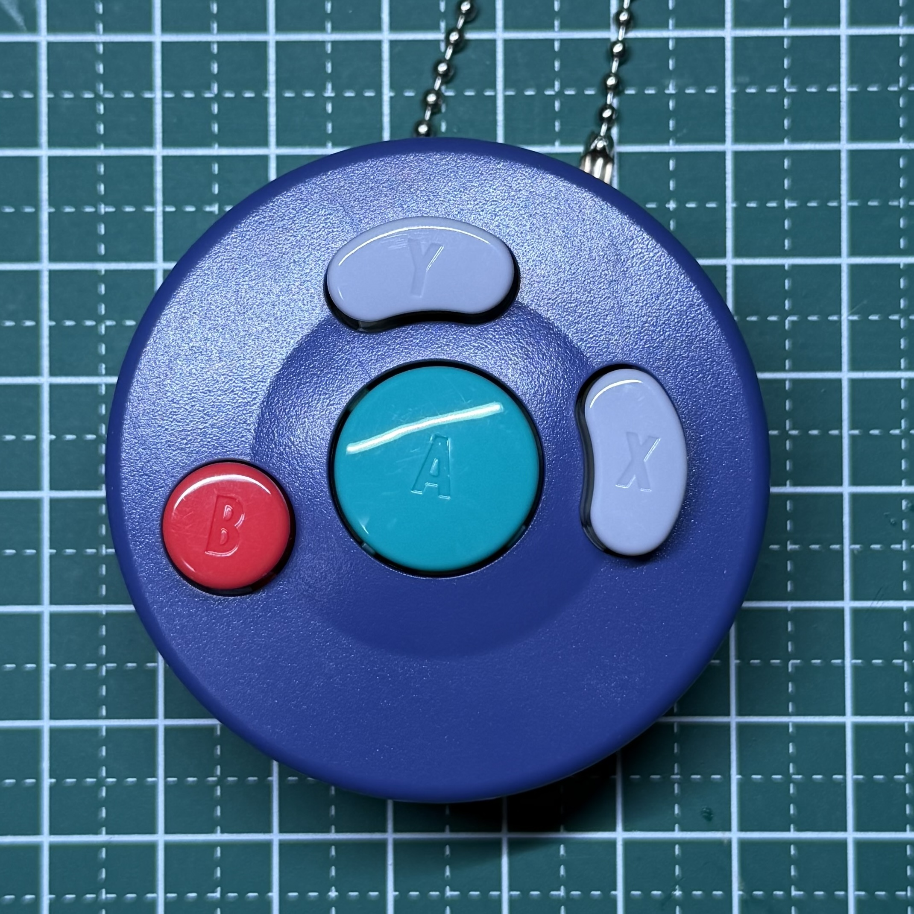
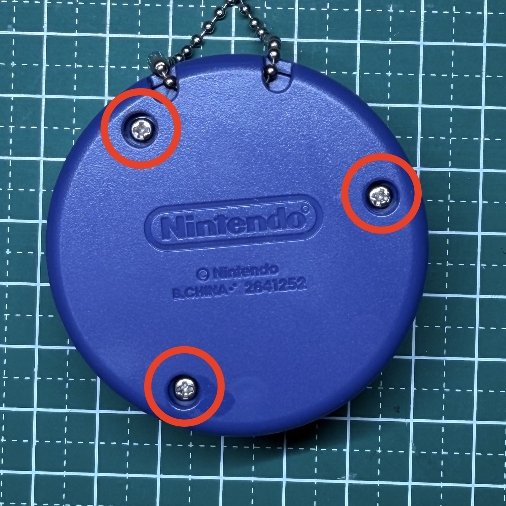
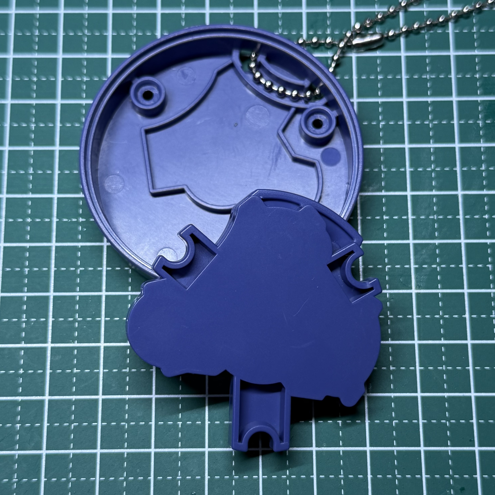
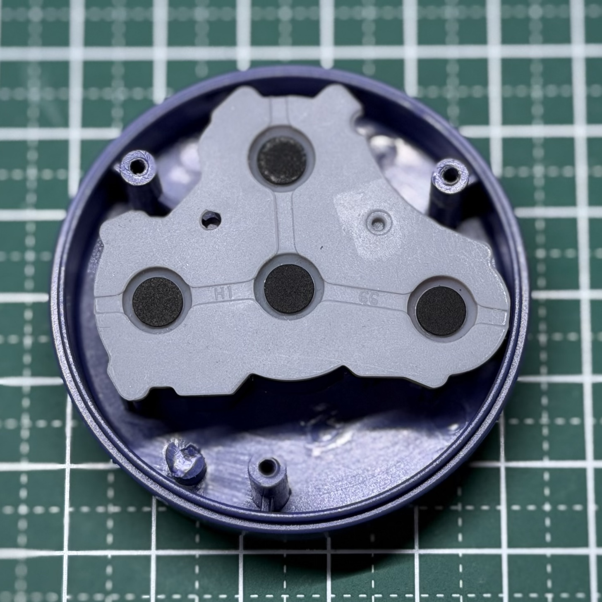
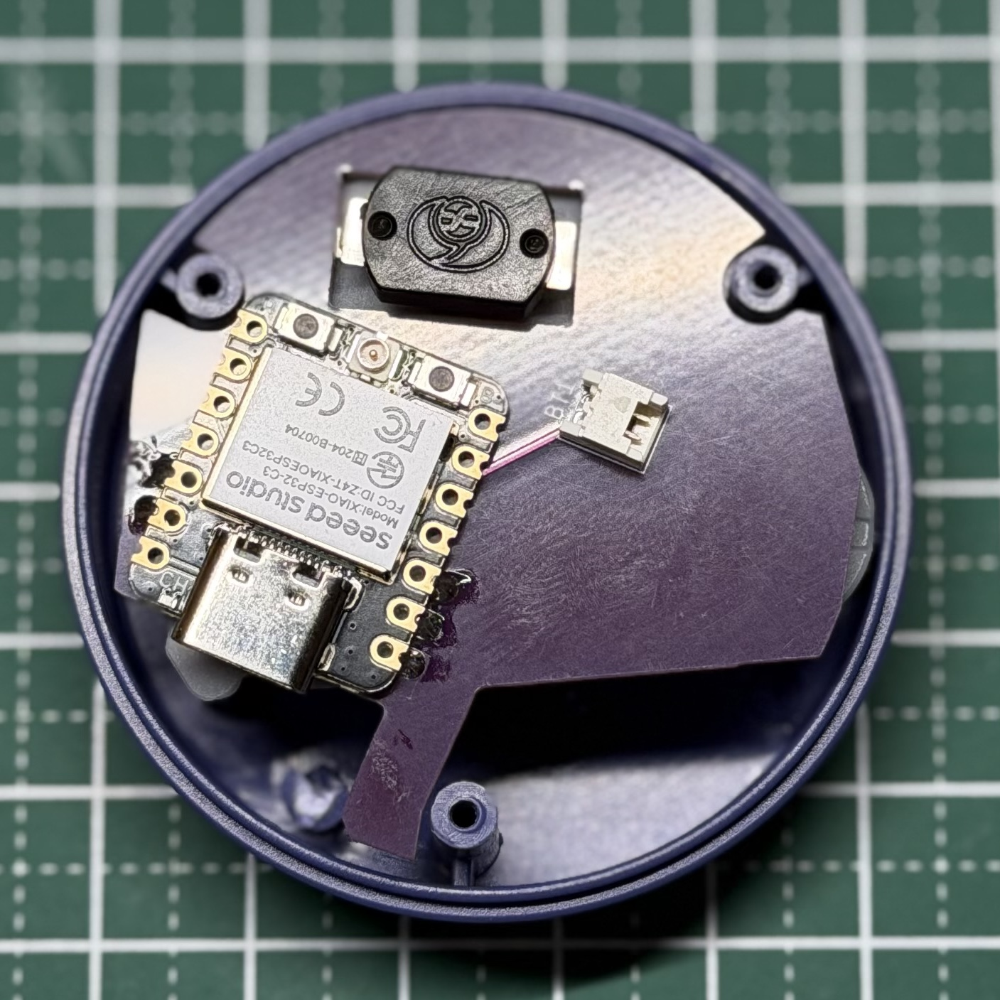
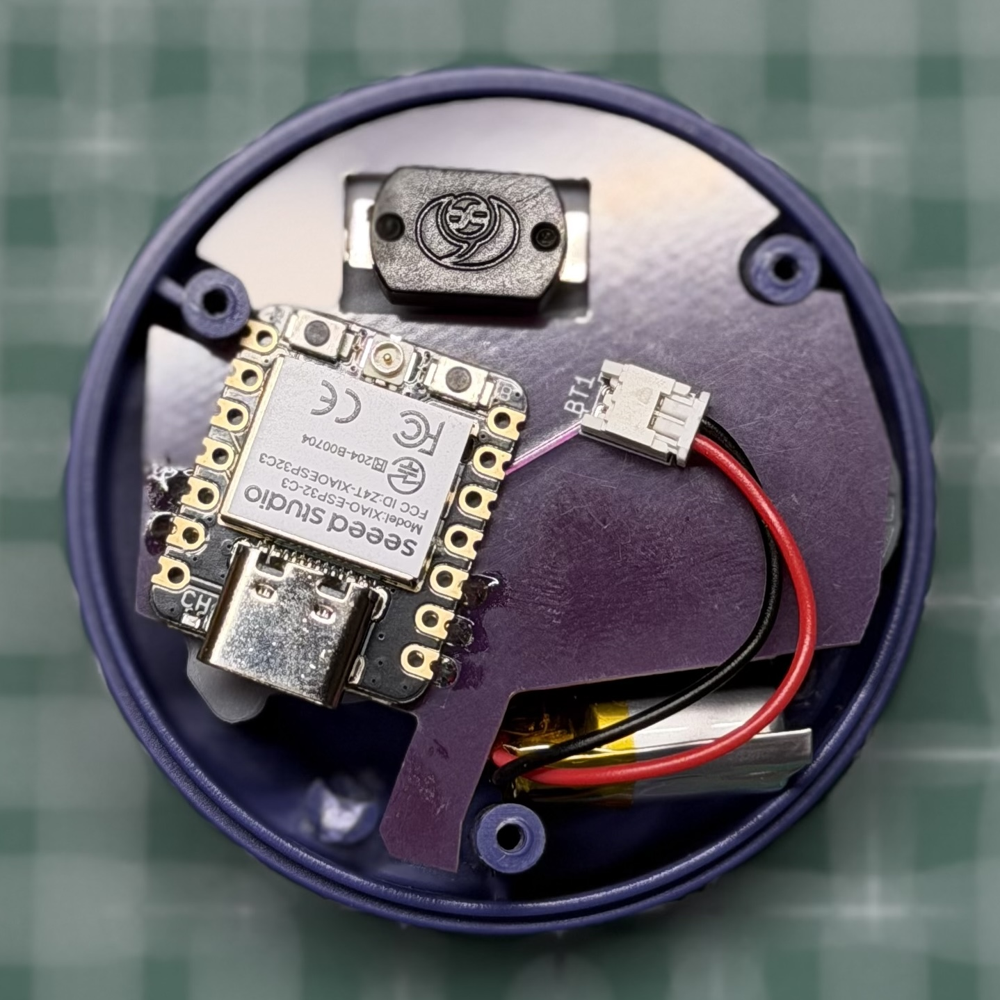
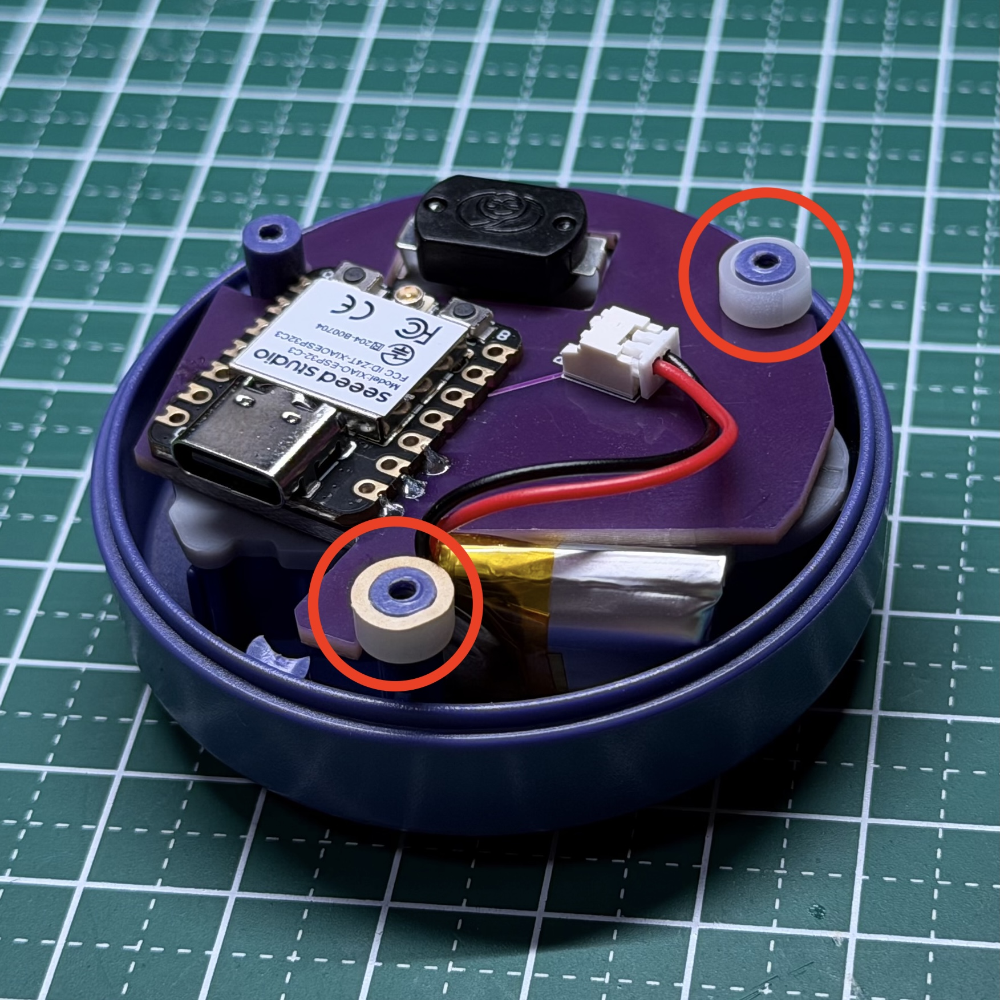
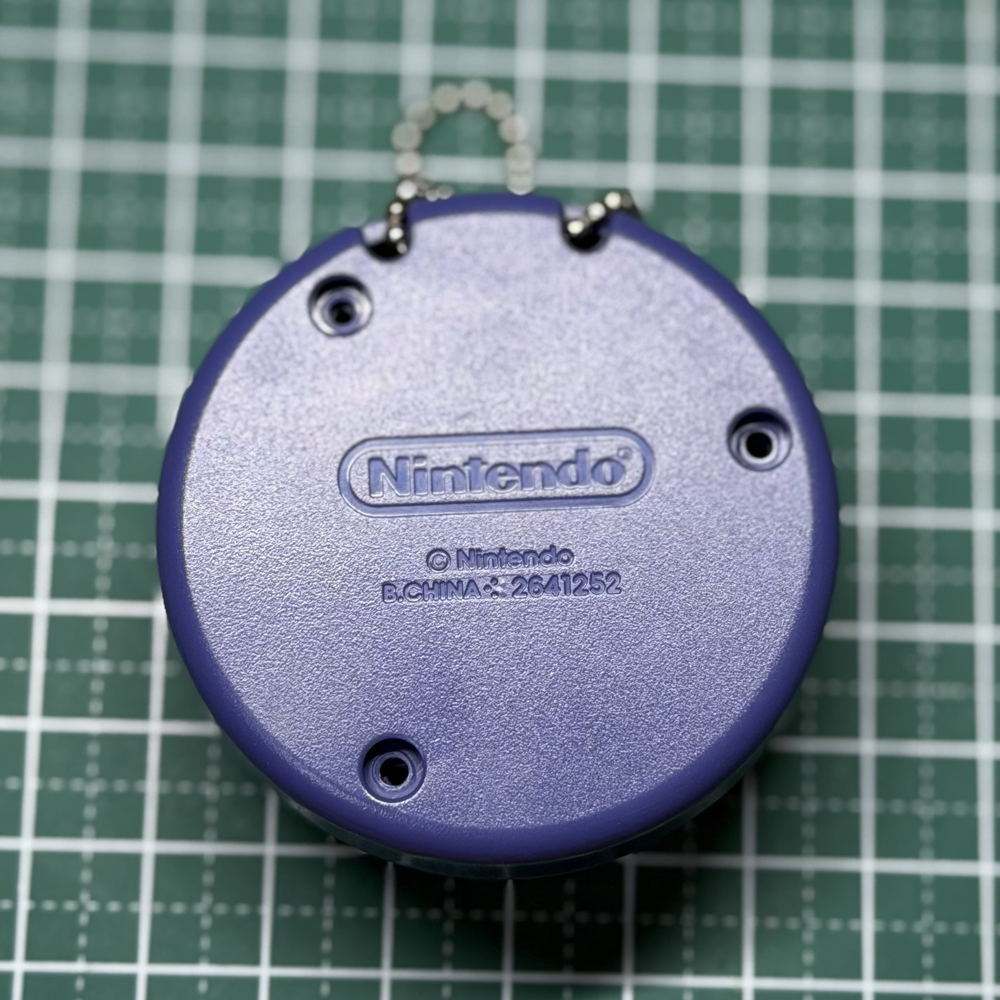

# ビルドガイド
これは[ニンテンドーストア等](https://x.com/N_Officialstore/status/1815552413207846971)で販売しているカプセルトイ「コントローラーボタンコレクション」第2弾の「ニンテンドー ゲームキューブ：A・B・X・Yボタン」を簡便なBluetoothリモコンにするキットです。  
  
「ニンテンドー ゲームキューブ：A・B・X・Yボタン」はキーホルダー（以下キーホルダーと呼びます）になっていて、中には導電ゴムのスイッチも入っています。それをそのまま利用して（無加工で）狭いキーホルダー内に基板や電源を詰め込みました。  
組み立てて電源を入れるとスマホなどで使えるBluetoothリモコンになります。
  
ボタンが少ないから機能は少なめ、でもキーホルダーが実際に使えてちょっと嬉しい。  
そんな気持ちになるキットです。


## 必要な素材・道具
* リモコン化キット
  * 基板
    * Xiao ESP32C3が載っています。プログラムを書き換えられます。
  * リポバッテリー
  * スペーサー × 3
* プラスドライバー

## 組み立て方  
1. キーホルダーの裏のネジ3つ(写真の赤丸)を外す  


2. 背面の中にあるパーツを外す（キットを使わない時は必要なので捨てないこと）  

3. マイコン(Xiao ESP32C3）が見える側を上にしてゴムスイッチに載せる  


4. 隙間にバッテリーを入れて基板に繋ぐ  

5. 写真の赤丸の位置にスペーサーを入れる  

6. ケーブルを挟まないように背面を戻す  

7. ネジを締めて完成  

## 取り出し方  
組み立て方の手順で基板を取り出してください。

## 電源のON/OFFとペアリング
この基板には電源LED等はありません。そのため電源のON/OFFはスマホなどからBluetoothのペアリングの状態から確認してください。  
電源を入れるとBluetooth設定に「GC-Right」が出るので選択してペアリングします。

## 充電
電源をONにしたままでESP32C3にType-Cケーブルを挿せば充電が始まります。
### 注意
ESP32C3のバッテリー充電回路は簡易なものです。充電したまま長時間放置することのないようお気をつけください。  
空から満充電までの時間の目安は1時間です。

## プログラミング
このキットはArduino IDEを使ってプログラムの書き換えが可能です。基板上のXiao ESP32C3をパソコンと接続してください。
### Arduino IDEの設定
Arduino IDEの設定の準備は搭載マイコンの[Xiao ESP32C3のスタートガイド](https://wiki.seeedstudio.com/ja/XIAO_ESP32C3_Getting_Started/)を参照してください。ただしサンプルプログラムは外部ライブラリーに対応するためにesp32のバージョンを「2.0.17」にしてください。その後外部ライブラリー[T-vK/ESP32-BLE-Keyboard](https://github.com/T-vK/ESP32-BLE-Keyboard)を使用するのでインポートしてください。
### プログラム
ボタンはA→GPIO2, B→GPIO3, X→GPIO4に接続されています。  
サンプルプログラムは以下のような操作が出来ます。
|ボタン|キー操作|
|--|--|
|Aボタン|Aキー|
|Bボタン|Bキー|
|Xボタン|Xキー|
|A長押し|Enter1回|
|B長押し|BackSpace連打|
  
#### サンプルプログラム

サンプルプログラムは `sample/keyboard_abx/keyboard_abx.ino` にあります。

```cpp
// sample/keyboard_abx/keyboard_abx.ino
#include <BleKeyboard.h>
#include <BLESecurity.h>
#include <BLEDevice.h>

// ===== BLE Keyboard Name & UUID =====
BleKeyboard bleKeyboard("GC-Right", "GC", 100);

// ===== GPIO設定 =====
const int numPins = 3;
const int pins[numPins] = {2, 3, 4};   // GPIOを指定。B=GPIO2, X=GPIO3, A=GPIO4


// ===== キー設定 =====

// 短押し時の送信キーコード
const char SHORTPRESS_A_KEY = 'a';       // Aボタン短押し時に送信（aキー）
const char SHORTPRESS_B_KEY = 'b';       // Bボタン短押し時に送信（bキー）
const char SHORTPRESS_X_KEY = 'x';       // Xボタン短押し時に送信（xキー）

// 長押し時の送信キーコード（外部変数で変更可能）
char LONGPRESS_A_KEY = '\n';  // Aボタン長押しで送るキー（Enter）
char LONGPRESS_B_KEY = '\b';  // Bボタン長押しで送るキー（Backspace）
char LONGPRESS_X_KEY = 'X';   // Xボタン長押しで送るキー（x）

// 長押し有効/無効の設定（個別変数）
bool longPressEnabled_A = true;   // Aボタンの長押し有効/無効
bool longPressEnabled_B = true;   // Bボタンの長押し有効/無効
bool longPressEnabled_X = false;  // Xボタンの長押し有効/無効

// ボタン連打有効/無効の設定（個別変数）
bool repeatEnabled_A = false;    // Aボタンの連打有効/無効
bool repeatEnabled_B = true;     // Bボタンの連打有効/無効
bool repeatEnabled_X = false;    // Xボタンの連打有効/無効


// ===== デバウンス & 長押し設定 =====
// ボタン入力の安定化や長押し／連打動作を制御するための時間設定（単位：ms）
// デフォルト値は一般的なタクトスイッチで安定動作する推奨設定です。
// 各値を調整することで、反応速度や操作感をカスタマイズできます。

const unsigned long debouncePressMs   = 10;   // 押下確定までの時間（デフォルト：10ms）
const unsigned long debounceReleaseMs = 50;  // 解放確定までの時間（デフォルト：50ms）
const unsigned long longPressMs       = 300;  // 長押し判定までの時間（デフォルト：300ms）
const unsigned long repeatRateMs      = 60;   // 長押し中の連打周期（デフォルト：60ms）

/*
──────────────────────────────────────────────
【各パラメータの意味と調整の目安】
──────────────────────────────────────────────

■ debouncePressMs（押下確定まで）
　・ボタンが押されてからこの時間以上連続して押されていれば「押下」と確定。
　・小さくすると：反応が速くなるが、チャタリング（誤検出）のリスクが増える。
　・大きくすると：誤検出は減るが、軽い押しでは反応しづらくなる。
　・目安：10〜30ms

■ debounceReleaseMs（解放確定まで）
　・ボタンが離されてからこの時間以上離れていれば「解放」と確定。
　・小さくすると：次の押下を早く受け付ける（＝連打しやすくなる）。
　・大きくすると：誤検出は減るが、連打が効きにくくなる。
　・目安：50〜100ms

■ longPressMs（長押し閾値）
　・押下状態がこの時間を超えたら「長押し」と判定。
　・小さくすると：少し長めのタップでも長押し扱いされやすくなる。
　・大きくすると：意図的にしっかり押さないと長押しとして認識されない。
　・目安：200〜500ms

■ repeatRateMs（長押し中の連打周期）
　・長押し中、この間隔ごとに押下イベントを繰り返し送出。
　・小さくすると：連射速度が上がる（ゲーム操作などに有効）。
　・大きくすると：連射速度が下がるが安定性が上がる。
　・目安：30〜100ms

──────────────────────────────────────────────
【調整のヒント】
──────────────────────────────────────────────
　● 軽く押しても反応しない → debouncePressMs を小さく（例：30 → 10）
　● 連打が効かない         → debounceReleaseMs を小さく（例：100 → 50）
　● 長押しの反応が遅い     → longPressMs を小さく（例：300 → 200）
　● 長押し中の連射を速く   → repeatRateMs を小さく（例：60 → 40）

※ 短くしすぎると誤検出が増えるため、実機で確認しながら調整してください。
*/


// ===== 状態管理 =====
int  activeIndex = -1;
bool stableLow[numPins] = {false,false,false};
int  lastRaw[numPins]   = {HIGH, HIGH, HIGH};
unsigned long lastEdgeAt[numPins] = {0,0,0};

bool longMode = false;
bool sentEnterForA = false;
unsigned long pressedAt = 0;
unsigned long lastRepeatAt = 0;

// 接続状態の変化を検出して広告モードを切り替える
bool wasConnected = false;
unsigned long advModeSince = 0;
enum AdvMode { ADV_FAST, ADV_SLOW };
AdvMode advMode = ADV_FAST;

// 短押しのキー割り当て（B=GPIO2, X=GPIO3, A=GPIO4）
char keyOfPin(int pin) {
  switch (pin) {
    case 2: return SHORTPRESS_B_KEY;   // Bボタン
    case 3: return SHORTPRESS_X_KEY;   // Xボタン
    case 4: return SHORTPRESS_A_KEY;   // Aボタン
  }
  return 0;
}

// 長押し判定配列
bool longPressEnabled[3] = {longPressEnabled_A, longPressEnabled_B, longPressEnabled_X};
bool repeatEnabled[3] = {repeatEnabled_A, repeatEnabled_B, repeatEnabled_X};

// 広告パラメータ切り替え（0.625ms単位）
void setFastAdvertising() {
  BLEAdvertising* adv = BLEDevice::getAdvertising();
  adv->setScanResponse(true);
  adv->addServiceUUID(BLEUUID((uint16_t)0x1812)); // HIDサービスを広告に載せる
  adv->setMinInterval(0x20);  // ≈20ms
  adv->setMaxInterval(0x30);  // ≈30ms
  // 接続後の希望（端末が必ず従うわけではないが提示）
  adv->setMinPreferred(0x06); // 7.5ms
  adv->setMaxPreferred(0x0C); // 15ms
  BLEDevice::startAdvertising();
  advMode = ADV_FAST;
  advModeSince = millis();
}

void setSlowAdvertising() {
  BLEAdvertising* adv = BLEDevice::getAdvertising();
  adv->setScanResponse(true);
  adv->addServiceUUID(BLEUUID((uint16_t)0x1812));
  adv->setMinInterval(0x80);  // ≈80ms
  adv->setMaxInterval(0xA0);  // ≈100ms
  adv->setMinPreferred(0x06);
  adv->setMaxPreferred(0x0C);
  BLEDevice::startAdvertising();
  advMode = ADV_SLOW;
  advModeSince = millis();
}

void setup() {
  Serial.begin(115200);

  for (int i = 0; i < numPins; i++) {
    pinMode(pins[i], INPUT_PULLUP);    // ピンのプルアップ設定、ボタンはGND接地でON
  }

  bleKeyboard.begin(); // BLE初期化

  // 起動直後は"高速アドバタイズ"で即アピール
  setFastAdvertising();

  // ペアリングチューニング
  BLESecurity* pSec = new BLESecurity();
  pSec->setCapability(ESP_IO_CAP_NONE);
  pSec->setAuthenticationMode(ESP_LE_AUTH_BOND);
  pSec->setKeySize(16);
  pSec->setInitEncryptionKey(ESP_BLE_ENC_KEY_MASK | ESP_BLE_ID_KEY_MASK);

  Serial.println("Ready with remapped pins (B=2, X=3, A=4).");
}


void loop() {
  // 接続状態の変化で広告モードを調整
  bool connected = bleKeyboard.isConnected();
  if (connected && !wasConnected) {
    // 接続後省電力のスロー広告
    setSlowAdvertising();
  }
  if (!connected && wasConnected) {
    // 切断の際に高速広告で再アピール
    setFastAdvertising();
  }
  // 未接続が長い時にスローへ戻す省電力運用
  if (!connected && advMode == ADV_FAST && millis() - advModeSince > 30000UL) {
    setSlowAdvertising();
  }
  wasConnected = connected;

  if (!connected) { delay(1); return; }

  const unsigned long now = millis();

  // デバウンス処理
  for (int i = 0; i < numPins; i++) {
    const int raw = digitalRead(pins[i]);
    if (raw != lastRaw[i]) {
      lastRaw[i] = raw;
      lastEdgeAt[i] = now;
    } else {
      const unsigned long need = (raw == LOW) ? debouncePressMs : debounceReleaseMs;
      if ((now - lastEdgeAt[i]) >= need) {
        stableLow[i] = (raw == LOW);
      }
    }
  }

  if (activeIndex == -1) {
    // 新規押下の確定
    for (int i = 0; i < numPins; i++) {
      if (stableLow[i]) {
        activeIndex = i;
        longMode = false;
        sentEnterForA = false;
        pressedAt = now;
        lastRepeatAt = now;
        break;
      }
    }
  } else {
    const int i = activeIndex;
    const int pin = pins[i];

    // 長押し移行
    if (!longMode && stableLow[i] && (now - pressedAt >= longPressMs)) {
      longMode = true;

      // ボタンインデックスを取得（A=0, B=1, X=2）
      int buttonIndex = -1;
      if (pin == 4) buttonIndex = 0;      // Aボタン
      else if (pin == 2) buttonIndex = 1; // Bボタン
      else if (pin == 3) buttonIndex = 2; // Xボタン

      // 長押しが有効な場合のみ処理
      if (buttonIndex >= 0 && longPressEnabled[buttonIndex]) {
        if (pin == 4 && !sentEnterForA) {      // A長押し
          bleKeyboard.write(LONGPRESS_A_KEY);
          sentEnterForA = true;
        } else if (pin == 2) {                 // B長押し
          // 長押し移行後に特に何もしない（下の処理に移る）
        } else if (pin == 3) {                 // X長押し
          bleKeyboard.write(LONGPRESS_X_KEY);
        }
      }
    }

    // 長押し中の連打処理（長押しと連打が有効な場合のみ）
    if (longMode && stableLow[i]) {
      // ボタンインデックスを取得（A=0, B=1, X=2）
      int buttonIndex = -1;
      if (pin == 4) buttonIndex = 0;      // Aボタン
      else if (pin == 2) buttonIndex = 1; // Bボタン
      else if (pin == 3) buttonIndex = 2; // Xボタン
      
      // 長押しと連打が有効な場合のみ処理
      if (buttonIndex >= 0 && longPressEnabled[buttonIndex] && repeatEnabled[buttonIndex]) {
        if (now - lastRepeatAt >= repeatRateMs) {
          char repeatKey = 0;
          if (pin == 4) repeatKey = LONGPRESS_A_KEY;      // Aボタン
          else if (pin == 2) repeatKey = LONGPRESS_B_KEY; // Bボタン
          else if (pin == 3) repeatKey = LONGPRESS_X_KEY; // Xボタン
          
          if (repeatKey) {
            bleKeyboard.write(repeatKey);
            lastRepeatAt = now;
          }
        }
      }
    }

    // 離されたら処理
    if (!stableLow[i]) {
      if (!longMode) {
        // 短押し（a/b/x）
        char k = keyOfPin(pin);
        if (k) bleKeyboard.write(k);
      }
      activeIndex = -1;
    }
  }

  delay(1);
}
```


