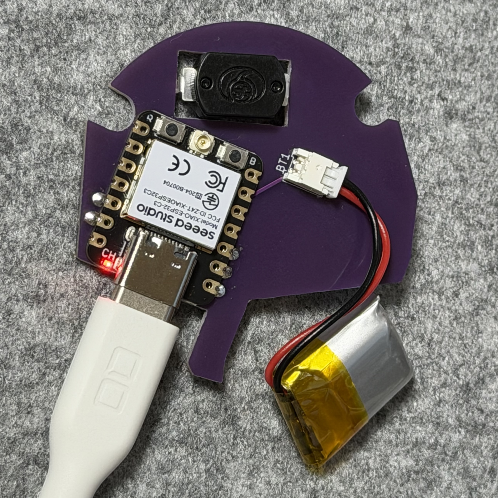
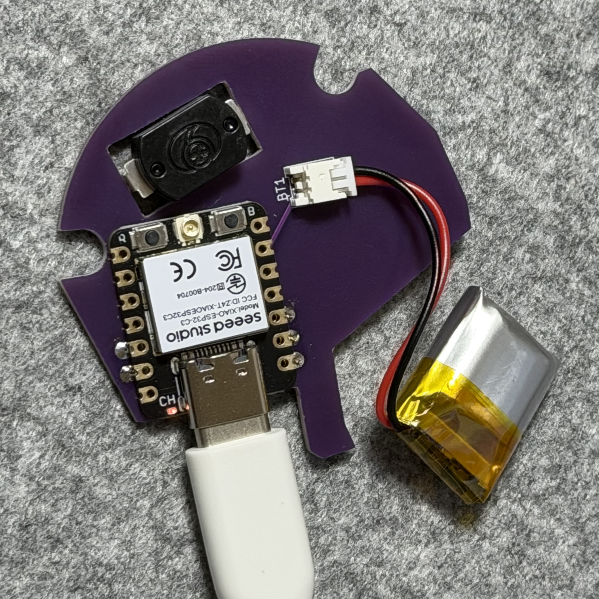
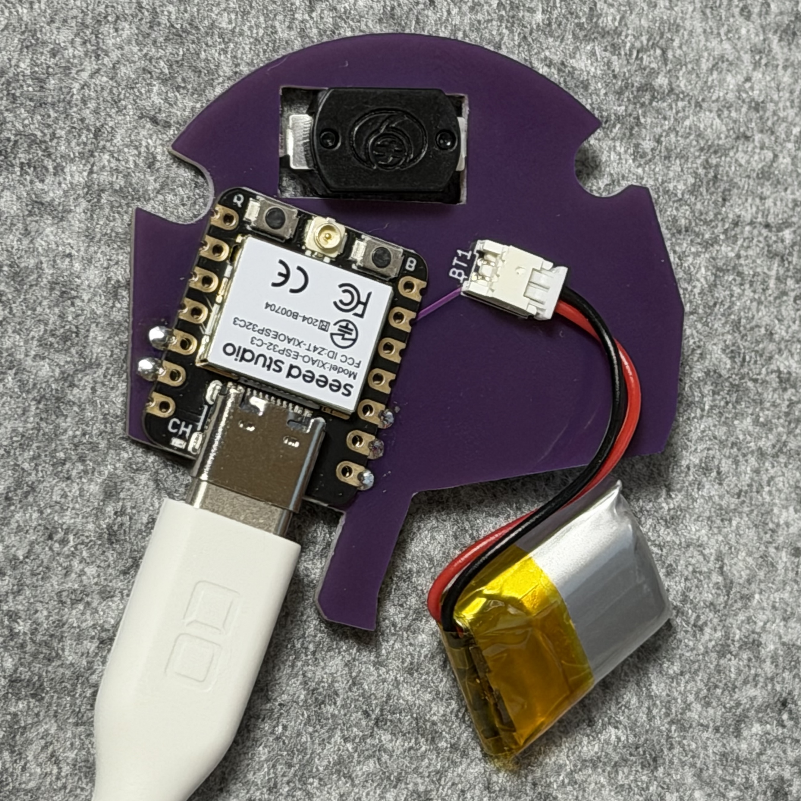
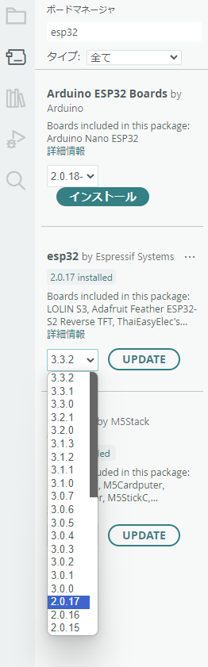

# ビルドガイド
これは[ニンテンドーストア等](https://x.com/N_Officialstore/status/1815552413207846971)で販売しているカプセルトイ「コントローラーボタンコレクション」第2弾の「ニンテンドー ゲームキューブ：A・B・X・Yボタン」を簡便なBluetoothリモコンにするキットです。  
  
「ニンテンドー ゲームキューブ：A・B・X・Yボタン」はキーホルダー（以下キーホルダーと呼びます）になっていて、中には導電ゴムのスイッチも入っています。それをそのまま利用して（無加工で）狭いキーホルダー内に基板や電源を詰め込みました。  
組み立てて電源を入れるとスマホなどで使えるBluetoothリモコンになります。
  
ボタンが少ないから機能は少なめ、でもキーホルダーが実際に使えてちょっと嬉しい。  
そんな気持ちになるキットです。

## 必要な素材・道具
* リモコン化キット
  * 基板
    * Xiao ESP32C3が載っています。プログラムを書き換えられます。
  * リポバッテリー
  * スペーサー × 3
* プラスドライバー

## 組み立て方  
1. キーホルダーの裏のネジ3つ(写真の赤丸)を外す  

2. 背面の中にあるパーツを外す（キットを使わない時は必要なので捨てないこと）  

3. マイコン(Xiao ESP32C3）が見える側を上にしてゴムスイッチに載せる  

4. 隙間にバッテリーを入れて基板に繋ぐ  

5. 写真の赤丸の位置にスペーサーを入れる  

6. ケーブルを挟まないように背面を戻す  

7. ネジを締めて完成  

## 取り出し方  
組み立て方の手順で基板を取り出してください。

## 電源のON/OFF
Yボタンが電源スイッチになっています。  
この基板には電源LED等はありません。そのため電源のON/OFF状況はスマホなどからBluetoothのペアリングの状態から確認してください。  

## ペアリング
電源を入れるとBluetooth設定に「GC-Right」が出るので選択してペアリングします。  
名前はプログラム中で変更できます。

## 充電
電源をONにしたままでESP32C3にType-Cケーブルを挿せば充電が始まります。
### 充電状況の確認
充電状況は本体のLEDで確認できます。  
A. 充電中（電源スイッチがONになっています）  
　USB端子近くのLEDが強く点灯している。  
  
B. 非充電（電源スイッチがOFFになっています、充電していません）   
　USB端子近くのLEDが弱く点灯している。  
  
C. 充電完了（電源スイッチがONになっています）  
　USB端子近くのLEDが消灯している。  
  
### 注意
ESP32C3のバッテリー充電回路は簡易なものです。充電したまま長時間放置することのないようお気をつけください。  
空から満充電までの時間の目安は1時間です。

## プログラミング
このキットはArduino IDEを使ってプログラムの書き換えが可能です。基板上のXiao ESP32C3をパソコンと接続してください。
### Arduino IDEの設定
Arduino IDEの設定の準備は搭載マイコンの[Xiao ESP32C3のスタートガイド](https://wiki.seeedstudio.com/ja/XIAO_ESP32C3_Getting_Started/)を参照してください。ただしサンプルプログラムはesp32のバージョンを「2.0.17」にしてください。  
    
その後外部ライブラリー[T-vK/ESP32-BLE-Keyboard](https://github.com/T-vK/ESP32-BLE-Keyboard)をインポートしてください。
### プログラム
ボタンはA→GPIO2, B→GPIO3, X→GPIO4に接続されています。  
サンプルプログラムは以下のような操作が出来ます。
|ボタン|キー操作|
|--|--|
|Aボタン|Aキー|
|Bボタン|Bキー|
|Xボタン|Xキー|
|A長押し|Enter1回|
|B長押し|BackSpace連打|
  
#### サンプルプログラム

サンプルプログラムは `sample/keyboard_abx/keyboard_abx.ino` にあります。
